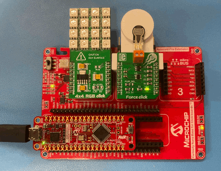
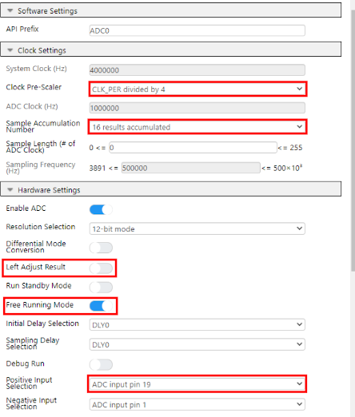
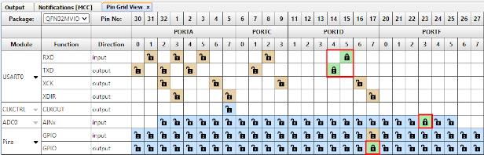
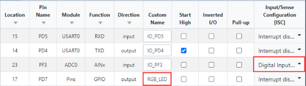

# Pressure Demo with AVR64DD32

Demonstration showing the harder the force-sensitive resistor is pressed, the more lights come on. The pressure is also sent out a UART interface that can be viewed locally. The AVR64DD32 contains the ADC and UART required to run this demonstration, called core-independent peripherals (CIPs). The LEDs light up in relation to the magnitude of the value the ADC reads. The ADC also internally filters the result by taking 16 measurements and reporting the average of them all, resulting in a smoother reading.

## Related Documentation

- [AVR64DD32 Datasheet](https://ww1.microchip.com/downloads/aemDocuments/documents/MCU08/ProductDocuments/DataSheets/AVR64DD32-28-Prelim-DataSheet-DS40002315B.pdf)
- [AVD64DD32 Curiosity Nano Hardware User Guide](https://ww1.microchip.com/downloads/aemDocuments/documents/MCU08/ProductDocuments/UserGuides/AVR64DD32CNANO-Prel-HW-UserGuide-DS50003323.pdf)
- [Curiosity Nano Base Board Hardware User Guide](https://ww1.microchip.com/downloads/en/DeviceDoc/Curiosity-Nano-Base-for-Click-boards-User-Guide-50002839B.pdf)

## Software Used

- MPLAB® X IDE 6.0.0 or newer [(MPLAB X IDE 6.0)](https://www.microchip.com/en-us/tools-resources/develop/mplab-x-ide?utm_source=GitHub&utm_medium=TextLink&utm_campaign=MCU8_MMTCha_avrdd&utm_content=avr64dd32-force-sensitive-resistor-mplab-mcc-github)
- MPLAB XC8 2.36.0 or newer compiler [(MPLAB XC8 2.36)](https://www.microchip.com/en-us/tools-resources/develop/mplab-xc-compilers?utm_source=GitHub&utm_medium=TextLink&utm_campaign=MCU8_MMTCha_avrdd&utm_content=avr64dd32-force-sensitive-resistor-mplab-mcc-github)
- MPLAB Code Configurator (MCC) 5.1.9 or newer [(MPLAB Code Configurator)](https://www.microchip.com/en-us/tools-resources/configure/mplab-code-configurator?utm_source=GitHub&utm_medium=TextLink&utm_campaign=MCU8_MMTCha_avrdd&utm_content=avr64dd32-force-sensitive-resistor-mplab-mcc-github)

## Hardware Used

- [AVR64DD32 Curiosity Nano (EV72Y42A)](https://www.microchip.com/en-us/development-tool/EV72Y42A?utm_source=GitHub&utm_medium=TextLink&utm_campaign=MCU8_MMTCha_avrdd&utm_content=avr64dd32-force-sensitive-resistor-mplab-mcc-github)
- [Curiosity Nano Base for Click boards™ (AC164162)](https://www.microchip.com/en-us/development-tool/AC164162?utm_source=GitHub&utm_medium=TextLink&utm_campaign=MCU8_MMTCha_avrdd&utm_content=avr64dd32-force-sensitive-resistor-mplab-mcc-github)
- [MikroE 4x4 RGB Click](https://www.mikroe.com/4x4-rgb-click)
- [MikroE Force Click](https://www.mikroe.com/force-click)

## Setup

Setup the hardware as shown:

*Note: The image below has an optional 3D printed insert that goes below the Force Click to give the force resistor support. It is convenient, but not required.*

{width=432px}

#### Configuration

Configure the software using either a pre-compiled binary, or manually configure everything yourself.

#### Option #1:

Easy setup - upload the pre-compiled binary:

* Download the repository
* Drag-and-Drop Program the AVR64DD32
  * Plug Curiosity Nano into windows and it will show up under File Explorer
  * Put .hex file (in dist folder) into Curiosity Nano folder in File Explorer and it will automatically program itself

Once the steps above are completed, continue to the *Operation* Section to see how to operate the demo

#### Option #2:
Setup from scratch - everything is manually configured from scratch, except for 3 files: main.c, and the driver files for the 4x4 LED grid: RGBClick_4x4.c and RGBClick_4x4.h.

##### Step #1: Create project
 * In MPLAB X, select File &rarr; New Project &rarr; Microchip Embedded &rarr; Standalone Project
 * Device: AVR64DD32, (plug in Curiosity Nano) Tool &rarr; AVRDD64DD32 Curiosity Nano  SN:...
 * Compiler Toolchain &rarr; select any XC8 compiler (v2.36+)
 * Select project name/location of your choosing, click finish.

##### Step #2: Setup MPLAB Code Configurator (MCC):
* Launch MCC by clicking the blue "MCC" shield at the top toolbar &rarr; Select MCC Melody &rarr; Finish. (If MCC is missing from the toolbar, install it by going Tools &rarr; Plugins &rarr; Available Plugins &rarr; MPLAB Code Configurator &rarr; Install). After configuring the ADC, UART, and pin configuration in MCC, main.c and RGBClick_4x4.c will handle everything else.

##### Analog-to-Digital-Converter (ADC)

* Add the ADC to the project
  * Select Device Resources &rarr; Drivers &rarr; ADC &rarr; + ADC0
* Once the ADC is added, modify the following sections.

  {width=444px}

ADC Configuration explanation:
  * Sample Accumulation Number: This takes multiple samples before reporting a result. This reduces the effect of outliers to create a more stable result. 16 samples are used, instead of more, because that is the maximum accumulation size amount (16-bits) the AVR64DD32 supports for a 12-bit reading. (Max 12-bit reading = 2^12 = 4096) * (16 readings) = 65536 = 2^16, which is the size of the accumulation register.

     {width=444px} From the AVR64DD32 datasheet [page 491](https://ww1.microchip.com/downloads/aemDocuments/documents/MCU08/ProductDocuments/DataSheets/AVR64DD32-28-Prelim-DataSheet-DS40002315B.pdf#page=491)
      

  * Left Adjust Result: The 12-bit value read is stored in a 16-bit register. This either left or right-justifies the result
  * Free Running Mode: Automatically starts the next ADC conversion as soon as the last one is finished.
  * Positive Input Selection: As shown in the picture below, the Force Click's Analog Pin, AN, is in the top left position. Since it is in the Curiosity base board's slot 2, that corresponds to the Curiosity Nano base board's 13th pin. On the AVR64DD32, the 13th pin is PORTF3, also known as AIN19, thus Analog input 19.

  {width=924px} 
  From Curiosity Nano Base Board Hardware User Guide [page 5](https://ww1.microchip.com/downloads/en/DeviceDoc/Curiosity-Nano-Base-for-Click-boards-User-Guide-50002839B.pdf#page=5) and AVD64DD32 Curiosity Nano Hardware User Guide [page 25](https://ww1.microchip.com/downloads/aemDocuments/documents/MCU08/ProductDocuments/UserGuides/AVR64DD32CNANO-Prel-HW-UserGuide-DS50003323.pdf#page=25)
   

##### Universal Asynchronous Receiver-Transmitter (UART)
  * Device Resources &rarr; Drivers &rarr; UART &rarr; + UART
    * Set UART PLIB Selector to USART0.

  {width=462px}

  * In the builder window, click USART0_Peripherals, enable Printf Support

  {width=385px}
 

##### Pin Configuration

  * Set pins in Pin Grid View
    * ADC0 &rarr; PORTF3
    * Pins, GPIO Output &rarr; PORTD7
    * USART0, TX &rarr; PORTD4
    * USART0, RX &rarr; PORTD5

  {width=616px}

  * Modify Pins
    * Project Resources &rarr; System &rarr; Pins
    * Set a name of pin PD7 to RGB_LED
    * Change the Input Sense Configuration for the ADC0 pin to Digital Input Buffer disabled

  {width=616px}

#### Step #5: Generate the project
  * Click the generate button in MCC by the Project Resources window to create the MCC generated header and source files

    *You can now close MCC by clicking the blue MCC shield again*

#### Step #6: Adding main.c, RGBClick_4x4.c and RGBClick_4x4.h
* Insert the .c and .h files into the Project
  * Copy **main.c**, **RGBClick_4x4.c**, and **RGBClick_4x4.h** into your project directory
  * Add the files into your project
    * Under the projects tab, right-click source files &rarr; add existing item &rarr; main.c, RGBClick_4x4.c
    * Right-click header files &rarr; add existing item &rarr; RGBClick_4x4.h

Make and Program Device
* Right-click project name &rarr; Make and Program Device

## Operation

On boot, the array will strobe random colors, green, then red before turning off. This will verify the LED array is connected and configured properly.

When the resistor is pressed, the LEDs should light up proportionally to the applied force. When the resistor is 100% pressed down, the lights will strobe through an array of colors.

To view the pressure the resistor is reporting, open MPLAB Data Visualizer from the toolbar (The green shield with DV on it). Under connections, select the COM port the Curiosity Nano is connected to and hit play.
Under the terminal input, select the same COM port. The pressure should now be displaying on the terminal.

{width=770px}

## Summary

This demo showed:
 - Using the advanced capabilities of built-in peripherals on the AVR64DD32, such as the ADC.
 - Configuring peripherals inside of MCC to quickly setup a new microcontroller project.
 - Connecting a Force click and 4x4 RGB Click to a Curiosity Nano Base Board.
 - Utilizing MPLAB Data Visualizer for viewing UART streams instead of requiring a 3rd-party program.
